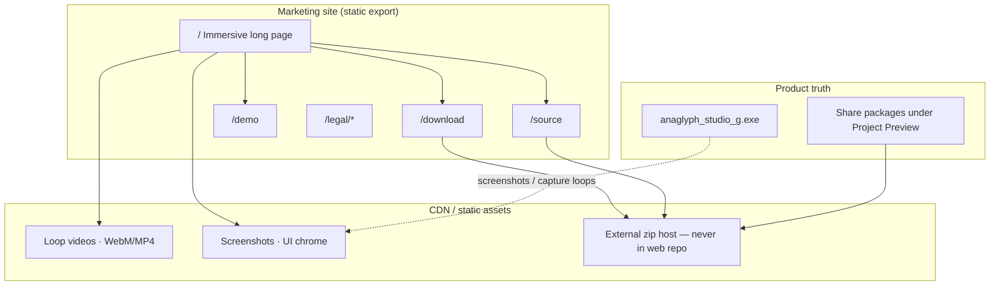
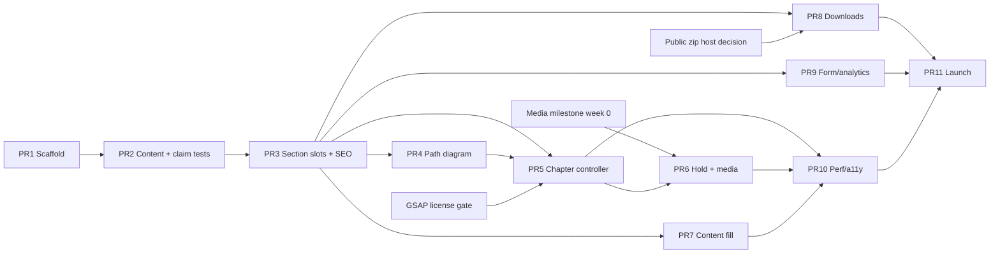

# Anaglyph Studio (G) — Product Marketing Website

| Field | Value |
|-------|--------|
| **Document title** | Product marketing website for Anaglyph Studio (G) |
| **Author / eng owner** | _Name before PR1 merge_ (scaffold + content model lead) |
| **Motion / media eng** | _Name before PR1 merge_ (or same solo eng) |
| **Product claim approver** | _Product owner — must sign claim registry before PR11 public_ |
| **Media capturer** | _Operator with Studio G + bicycle example; may be eng or PM_ |
| **Date** | 2026-07-18 |
| **Status** | Draft (revised post-review) |
| **Product** | Anaglyph Studio (G) — Windows desktop console for industrial mould setup & live AR outline tracking |
| **Audience** | Engineering leads, web implementers, product owners |
| **Related product sources** | `C:\dev\grok\Anaglyph Studio (source) - grok\` · share packages under `C:\Project Preview\Anaglyph Studio_G\` |
| **Creative reference** | [FS 60P product experience](https://thewatch.60fps.fr/) by 60fps — craft, motion, and exploration patterns only (not brand assets) |
| **Site repo (interim)** | Separate `anaglyph-studio-g-web` (not monorepo with private product tree) |

---

## Overview

Anaglyph Studio (G) is a **Windows desktop console** that collapses a multi-tool mould-PnP / CMM tracking pipeline into one professional dark UI (graphite + brass amber). Operators choose **Load · track**, **Build · PnP**, or **Build · CMM**, print AprilTag stickers and a ChArUco board at actual size, load or measure camera intrinsics, solve or ingest geometry, and lock a CAD outline onto a live mould with tag detection.

This document specifies a **premium product marketing website** that sells that story with the same confidence and craft as high-end industrial product sites—especially the immersive scroll/hold/explore language of [thewatch.60fps.fr](https://thewatch.60fps.fr/)—adapted for **software + industrial mould workflows**, not consumer AR or consumer watch branding.

The site is a **single cinematic long-page experience** (with light multi-route support for legal/download deep links), built as a **static-export Next.js app** with **GSAP ScrollTrigger (base plugin only until license confirmed) + lightweight canvas/video** (not a heavy full-product 3D configurator). Claims stay strictly truthful; CTAs point at ready-to-run and source+OpenCV zips already produced under the share package tree (measured **~49.5 MB** runtime / **~36.6 MB** source for the 2026-07-18 package—report `sizeHint` only from measurement).

---

## Background & Motivation

### Product reality (source of truth)

Studio G is an **isolated redesign** of Anaglyph Studio (`anaglyph_studio_g.exe`), not a rename of “Grok.” Primary implementation: `src/apps/anaglyph_studio_g.cpp` + `src/studio/gfx_grok.*` (Dear ImGui on Direct3D 11). Theme tokens from product code:

| Token | Approx. value | Role |
|-------|----------------|------|
| Background | `#0c0e11` | Near-black graphite |
| Panel | `#14181e` | Cool panels |
| Frame | `#1c222a` | Inputs / chrome |
| Accent | `#d4923c` | Brass amber CTAs |
| Accent hover | `~#e6a852` | Interactive lift |
| Text | `~#ebeef0` | Primary ink on dark |

Workflows (from product logic chain docs and `enum class Workflow`):

```text
Load · track   →  load scene JSON → Camera → [Calibrate optional] → Track
Build · PnP    →  Setup → Camera → Calibrate → Capture & solve → Scene → Track
Build · CMM    →  Setup → Camera → Calibrate → Scene → Track   (no Capture)
```

Supporting facts that marketing may use **only if phrased carefully**:

1. **One integrated Studio** instead of the numbered CLI chain (`anaglyph_calibrator` / `pnp` / `scene` / `live` + scripts).
2. **Two build methods**: photo-based multi-view PnP vs CMM-measured tag corners.
3. **Print-ready** AprilTag sheets + ChArUco calibration board (actual-size HTML/PDF/PNG via tag sheet tooling).
4. **Live tracking** with outline overlay; reprojection error in **px**, optional **approx mm** at object distance (`trackErrInMm` — approximate conversion `reproj * depth / fx`, not certified metrology).
5. **Camera intrinsics:** Studio supports **Load K**, **Measure K** (ChArUco), and **scene-embedded K**. A **FOV guess** also exists as an explicit **non-calibrated placeholder** for live lens when no real calib/scene K is available (`liveLensKind` / Track help: “FOV guess = placeholder only, not a real calibration”). Marketing may promote Load/Measure/scene K as the **proper path**; must **not** imply every session is always calibrated or that FOV guess is real K.
6. **Camera sources:** webcam, video file loop, **IC4** (shipped in 2026-07-18 runtime share), **Spinnaker** (CMake-optional `WITH_SPINNAKER`, not in default share `bin/`). Lead marketing with webcam / video / IC4; Spinnaker as “optional SDK build.”
7. **Stack**: C++17, OpenCV 4.11, Dear ImGui, D3D11; Windows 10/11 x64.
8. **Default tag dictionary** in examples/tests: `DICT_APRILTAG_36h11`; ChArUco board uses `DICT_5X5_100` (5×7 squares, 30 mm / 22 mm markers per core calibration docs).

Share packages (ready for CTA linking once hosted):

| Package | Location pattern | Measured size (2026-07-18) |
|---------|------------------|---------------------------|
| Runtime zip | `C:\Project Preview\Anaglyph Studio_G\YYYY-MM-DD\Anaglyph_Studio_G_*.zip` | **~49.5 MB** |
| Source + OpenCV build zip | `...\Anaglyph_Studio_G_Source_*.zip` | **~36.6 MB** |

Never commit these zips into the web repo; host externally (see Download contract).

### Why a marketing site now

- Preview zips exist; there is **no public narrative surface** that matches product quality.
- The old CLI script story under-sells the **mode-first Studio G UX** (Home cards, step strip, readiness gates).
- Industrial buyers respond to **precision aesthetics + workflow clarity**, not feature dumps.
- A 60fps-class experience differentiates from generic “download our OpenCV tool” pages and signals engineering seriousness.

### Pain points the site must avoid

| Pain | Mitigation |
|------|------------|
| Hype accuracy claims (“sub-mm AR”) | No invented tolerances; use product language (px / approx mm / CMM compare) |
| Confusing “Grok” branding | Product name is **Anaglyph Studio (G)** only |
| Implying SaaS / cloud | Desktop Windows offline console |
| Copying FS 60P brand | Adapt interaction grammar only |
| Overbuilt 3D budget | Prefer video loops + UI captures + procedural line art over full mould CAD WebGL |
| Implying always-calibrated K | FOV guess is a placeholder; promote Load/Measure K without “always” language |

---

## Goals & Non-Goals

### Goals

1. **Communicate the integrated pipeline** in under ~90 seconds of scroll for a technical visitor.
2. **Make the three workflows scannable** (Load / Build PnP / Build CMM) via interactive diagram, not prose alone.
3. **Project industrial cool**: dark graphite, brass amber, mono specs, cinematic motion at ~60 fps on a mid laptop.
4. **Drive two primary actions**: Download Studio_G (runtime) · Get source (build zip); secondary: Request demo / Contact.
5. **Stay claim-safe**: every numeric or accuracy phrase maps to product UI or docs, or is explicitly qualitative.
6. **Ship with 1–2 engineers** in incremental PRs (static-friendly hosting).

### Soft launch KPIs (review ~2 weeks after soft launch; not hard eng gates)

| KPI | Soft target | Signal |
|-----|-------------|--------|
| Pipeline chapter reach | ≥40% of sessions reach chapter “Solve/CMM” or later (`chapter_view`) | Story is being consumed |
| Primary CTA CTR | ≥8% of sessions click runtime or source download | CTAs are findable |
| Claim-safety regressions | **Zero** invented accuracy phrases in shipped copy (claim registry + owner sign-off) | Product trust |
| Demo form | Track completions qualitatively; no hard quota v1 | Lead quality over volume |

### Non-Goals

- Not a documentation portal (architecture/algorithms stay in product `docs/` or a later docs site).
- Not a WebAssembly port of the tracker or live camera in-browser.
- Not multi-language localization (v1 English).
- Not authenticated download portal / license keys (direct zip or gated form only as config).
- Not pixel-perfect clone of thewatch.60fps.fr or use of their 3D models/assets.
- Not claiming certified CMM-grade live AR accuracy on real hardware without field data.
- Not advertising the original cyan-accent Studio as the hero product (Studio G branding only).
- Not shipping Club GSAP plugins (ScrollSmoother, etc.) until license confirmed.

---

## Proposed Design

### Creative concept

**Metaphor:** The product is not a watch to disassemble—it is a **tracking lock**. The hero is a mould (or abstract industrial form) with a **CAD outline snapping into registration** under brass-amber linework. Scroll “explores the pipeline” the way FS 60P explores parts: Setup → Tags → K → Solve/CMM → Scene → Track.

**Affect:** confidence, precision, industrial cool — **not** toy AR, neon consumer filters, or playful stickers culture.

**Reference adaptations** (from FS 60P interaction language):

| Reference pattern | Studio G adaptation |
|-------------------|---------------------|
| Full-viewport product hero + typography | Hero: locked outline on mould + wordmark “ANAGLYPH STUDIO (G)” |
| SWAP / color variants | “SWAP PATH” — Load / Build·PnP / Build·CMM path highlighter |
| HOLD TO EXPLORE | Hold/scrub a tracking loop or explode scene graph (tags → corners → outline) |
| SELECT MODEL | SELECT WORKFLOW (three cards) or SELECT CAMERA SOURCE (webcam / video / IC4; Spinnaker as optional build) |
| Specs as you explore parts | Specs reveal per chapter (dictionary, stack, K, error units) |
| Drag & tap to explore | Drag orbit on simplified scene preview; tap step nodes |
| Dark refined engineering | Graphite + brass amber tokens from `gfx_grok.cpp` |

### Information architecture

**Primary: single immersive long page** (`/`) with sticky chapter rail.

**Secondary routes** (thin chrome, no heavy WebGL):

| Route | Purpose |
|-------|---------|
| `/` | Marketing experience |
| `/download` | Deep-linkable download + system requirements + checksums |
| `/source` | Build prerequisites (MSVC, OpenCV path, optional IC4/Spinnaker) |
| `/demo` | Contact / request demo form |
| `/legal/privacy`, `/legal/terms` | Minimal legal |
| `/press` optional | Logo pack + approved screenshots |

Chapter map on `/` (also the **sections registry** order — see Data Model):

```text
00  Loader / brand
01  Hero — lock the outline
02  Problem — CLI chain vs one Studio
03  Explore the pipeline (scroll chapters)
      Setup · Tags · Camera K · Solve/CMM · Scene · Track
04  Three paths (interactive diagram)
05  Hold to explore (tracking / scene graph)
06  Specs & stack
07  Print & calibrate (tags + board)
08  Cameras & industrial options
09  Download / Source / Demo CTAs
10  Footer
```



### Visual system

**Colors (CSS variables — align with product):**

```css
:root {
  --bg: #0c0e11;
  --panel: #14181e;
  --frame: #1c222a;
  --border: rgba(255, 255, 255, 0.06);
  --text: #ebeef0;
  --muted: #8b929a;
  --accent: #d4923c;
  --accent-hi: #e6a852;
  --accent-lo: #ad7329;
  --ink-on-accent: #1f1a12;
  --ok: #59b87a;
  --warn: #e0ad5a;
  --bad: #e05c57;
  --mono: "IBM Plex Mono", "Cascadia Code", ui-monospace, monospace;
  --sans: "Inter", "Segoe UI", system-ui, sans-serif;
  /* Display: one distinctive geometric/industrial face — e.g. "Syne" or "Space Grotesk" */
  --display: "Space Grotesk", var(--sans);
}
```

**Typography:**

- **Display** for hero words (“LOCK”, “PIPELINE”, “STUDIO G”) — large, tracked, cinematic.
- **Sans** for body (max ~62ch).
- **Mono** for specs, paths, workflow labels (`Build · PnP`), step indices (`01 / 06`).
- **Self-host** display + mono + sans subsets via `next/font` or `public/fonts` (no render-blocking Google CDN in production). Owned by PR1 / PR10 polish.

**Motion language:**

- Scroll-linked progress (0–1 per chapter) drives opacity, clip-path, line draw; **does not** drive the Hold video (see Chapter controller + Media scrub contracts).
- Micro-interactions: brass underlines, soft magnetic snap on path nodes, HOLD progress ring.
- Loader: short branded sequence (outline stroke + accent pulse) — max ~1.5s when motion allowed; **skip entirely** when `prefers-reduced-motion: reduce` **or** `sessionStorage` has seen loader; never block content >3s on mid network.

### Stack recommendation (concrete)

| Layer | Choice | Rationale |
|-------|--------|-----------|
| Framework | **Next.js (App Router) + TypeScript** | File routes for thin secondary pages; excellent static export; familiar for 1–2 eng |
| Export | **`output: 'export'`** static HTML | No server required; GitHub Pages / any CDN |
| Images | **`images: { unoptimized: true }`** (or custom static loader) | Required for reliable static export; never route download zips through the image optimizer |
| Styling | **Tailwind CSS v4** + CSS variables | Fast iteration; design tokens map cleanly |
| Scroll / timeline | **GSAP + ScrollTrigger only** (public npm package) | Industry standard; **no ScrollSmoother / Club plugins** until license confirmed |
| 3D / WebGL | **R3F only if needed** for abstract scene graph; **default: Canvas 2D / CSS + video** | Mid-laptop 60fps budget; avoid shipping a full mould mesh |
| Media | Optimized **WebM + MP4** loops, AVIF/WebP stills | Hero fidelity without WASM OpenCV; scrub profile below |
| Content | **Typed TS content modules** (`content/site.ts`) + sections registry | Copy review without hunting JSX; parallel PRs |
| Analytics | Plausible (preferred) or GA4 (privacy-reviewed) | Optional; no cookie wall if privacy-first |
| Forms | **Formspree / Getform** interim (or mailto fallback) until CRM chosen | Demo request without backend on static host |
| CI | GitHub Actions: lint, typecheck, claim unit tests, Lighthouse CI, deploy | Matches private GitHub product org pattern |

**Client-boundary / SSR strategy (static export):**

- PR3 sections render **readable static HTML** with no motion JS required (progressive enhancement).
- Motion components (`ChapterRail`, scroll effects, `HoldExplore`, path diagram animation) are **`"use client"`** islands loaded after first paint where possible (`dynamic(() => import(...), { ssr: false })` for GSAP-heavy modules).
- GSAP + ScrollTrigger: **dynamic import after first paint or on first chapter enter** — never in the critical SSR/hydration path for above-fold text.
- Path diagram: static SVG + CSS focus works without JS; SWAP enhancement hydrates client-side.

**Why not pure Vite SPA only?** Next static export is essentially the same deploy model with better defaults for multi-route SEO. Vite + React is acceptable if the team already standardizes on Vite; keep the rest of the design identical.

**Why not full Three.js product replica?** Studio G’s value is **pipeline + live lock**, best shown with **real UI/capture video**. A watch-style exploded 3D model of a generic mould is expensive and less truthful.

### Animation system

```mermaid
sequenceDiagram
  participant U as User scroll / gesture
  participant ST as ScrollTrigger (lib/motion.ts)
  participant Ch as Chapter controller
  participant M as Media layer
  participant H as HoldExplore (gesture only)
  participant UI as DOM/UI chrome

  U->>ST: scroll progress p in [0,1] per chapter
  ST->>Ch: setActiveChapter(i, p)
  Ch->>UI: update rail, mono labels
  Ch->>M: crossfade stills / optional scroll-scrub (encode contract)
  U->>H: pointerdown / Space hold
  H->>H: rAF-throttled currentTime (never driven by scroll)
  Note over Ch,M: reduced-motion: static sections + rail jump; Hold becomes Play
```

#### Chapter controller contract (`lib/motion.ts`)

Single owner module registers and **`kill()`s** all ScrollTriggers on route change / unmount / reduced-motion enter. No ad-hoc `ScrollTrigger.create` outside this module.

```ts
// content/chapters.ts — declarative motion config (illustrative)
export type MediaMode = "none" | "crossfade" | "scroll-scrub" | "hold-scrub";

export interface ChapterMotion {
  id: string;                 // matches sections registry id
  pin?: boolean;              // default false for mobile; desktop pipeline chapters may pin
  /** Scroll distance while pinned / active — prefer vh for design, convert in motion.ts */
  scrollVh: number;           // e.g. 120–180 for pipeline chapters; 80–100 for short sections
  mediaMode: MediaMode;
  /** If scroll-scrub: must use scrub-encoded asset (see Media scrub contract) */
  scrubMediaId?: string;
}

// Pipeline defaults (v1):
// - mediaMode: 'crossfade' for Setup…Scene (still ↔ still or still ↔ short loop play once)
// - mediaMode: 'hold-scrub' ONLY on section "hold" (HoldExplore) — NOT on scroll
// - mediaMode: 'scroll-scrub' opt-in only if same encode profile as Hold and FPS QA passes
```

| Rule | Detail |
|------|--------|
| Ownership | Only `lib/motion.ts` creates/kills triggers; React effects call `registerChapters()` / `destroyMotion()` |
| Pin length | Desktop pipeline chapters: pin ≈ `scrollVh` 120–160; mobile: **no pin**, static stack |
| Rail | Sticky chapter rail updates `aria-current` from controller; at section boundaries snap active id when progress ≥0.5 into next |
| Scroll vs Hold | **Scroll never drives the Hold video.** Hold is pointer/keyboard-hold only. Pipeline chapters use `crossfade` / stills unless a chapter opts into `scroll-scrub` with the scrub encode contract |
| Reduced motion | Short-circuit: no pins, no scrub, no smoother; sections are static; rail becomes jump links (`href="#chapter-id"`) |
| Keyboard / no-JS | Skip link + in-page anchors work with motion JS disabled; rail anchors always in DOM from PR3 |
| Cleanup | `destroyMotion()` on unmount; also on `matchMedia('(prefers-reduced-motion: reduce)')` change |

#### Media scrub contract (HOLD TO EXPLORE + any scroll-scrub)

Naïve `video.currentTime = p * duration` on long-GOP H.264/WebM causes jank and decoder thrash on integrated GPUs. **v1 Hold scrub must follow this contract.**

| Parameter | Requirement |
|-----------|-------------|
| Clip length | **3–6 s** tracking loop (sweet spot: ~4 s) |
| Dual encode | **WebM (VP9 or AV1 if encode time allows) + MP4 (H.264)**; `<source>` order WebM then MP4 |
| Keyframes | Keyframe interval **≤ 0.25 s** (≤1 keyframe / 15 frames at 60 fps), **or all-intra** for short hero scrub assets |
| Scrub resolution | **1280×720** max for the scrubbable asset |
| Poster / hero still | **1920×1080** (or 2× display) AVIF/WebP; LCP candidate |
| Runtime seek | rAF-throttled: at most one `currentTime` assign per frame; **ignore** new seeks while `video.seeking === true` |
| Fallback ladder | (1) scrub WebM/MP4 → (2) if FPS/jank QA fails: **poster + Play** only → set `NEXT_PUBLIC_ENABLE_HOLD_EXPLORE=0` or runtime `holdMode: 'play-only'` |
| Predecode escape hatch | If seek quality still fails after dense keyframes: optional **canvas frame strip** (decode once offline or on idle) — PR6.1 only if needed |
| Mobile | **No hold-scrub**; required **tap Play** / pause; no hold-vs-scroll conflict (do not capture touch for hold on mobile) |
| Autoplay | Default **off** on mobile; any autoplay attempt requires `playsInline` + `muted`; respect reduced-data if detectable (`navigator.connection?.saveData`) |
| QA gate | On mid laptop (iGPU): hold scrub maintains ≥55 fps **or** long tasks <50 ms during scrub; else ship play-only |

#### Performance budget

**Split JS budgets** (gzip, broadband mid laptop):

| Budget item | Target | Notes |
|-------------|--------|-------|
| Framework baseline (React + Next client runtime) | **Measure & accept** as fixed (~150–250 KB gzip typical; record in PR10 baseline log) | Not a soft “prefer”; treat as known cost |
| App + motion **incremental** (page components + GSAP + ScrollTrigger after lazy load) | **Hard cap ≤ 120 KB gzip** beyond baseline for first interactive motion chunk | GSAP loaded post-paint / chapter enter |
| Critical path before motion | Above-fold HTML + CSS + fonts + hero poster; **no GSAP in critical path** | Aligns with PR3 readable-without-GSAP |
| Steady scroll FPS | ≥55–60 fps | No long main-thread tasks >16 ms during scroll |
| INP (Interaction to Next Paint) | **≤ 200 ms** for rail clicks, SWAP PATH, Hold start | Core Web Vitals |
| TBT (Total Blocking Time) lab | **≤ 300 ms** on mid throttling profile in Lighthouse CI | PR10 gate (warn then harden) |
| Long tasks during Hold scrub | **None > 50 ms** preferred | Else drop to play-only |
| LCP (hero still/poster) | < 2.5 s on broadband | Poster-first; video not LCP |
| Concurrent decoders | ≤1 full-bleed video active | Others poster + load on chapter enter |
| Texture/GPU | No multi-pass bloom; careful CSS blur | |
| Above-fold media + fonts + CSS (first visit) | **≤ ~500 KB** compressed | Mobile hard target; desktop aim same |

**Mobile budget (concrete):**

| Item | Target |
|------|--------|
| Autoplay video | **Off** |
| Decoded streams | Max **one** after explicit tap |
| Hold scrub | **Disabled**; Play control only |
| Pin / ScrollSmoother | **Off** |
| Above-fold bytes | **≤ ~500 KB** (poster + critical CSS + font subsets) |
| Full experience | Progressive: pipeline stills first; Hold media fetch on section enter only |

**Reduced motion (`prefers-reduced-motion: reduce`):**

- Listen with `matchMedia` **and** `change` events at runtime (user can toggle OS setting while tab open); call `destroyMotion()` / re-init static path.
- Disable any smoother / parallax / hold-scrub / scroll-scrub.
- Chapters become static stacked sections with instant navigation (rail jump links).
- Videos: poster + explicit Play control (no autoplay scrub).
- **Loader:** skip entirely when reduced motion **or** `sessionStorage` seen.
- **Hold control:** under reduced motion, do not leave a press-and-hold trap in tab order; expose **Play/Pause button** always; if Hold affordance remains visible, `aria-disabled="true"` and point assistive tech to Play.
- Keep focus states and skip links.

### Key experience modules

#### 1. Cinematic loader

- Wordmark, thin brass progress line, outline path morph.
- Skip when: `prefers-reduced-motion: reduce` **OR** `sessionStorage['asg-loader-seen']`.
- Max ~1.5s when shown; skippable click/Esc; never block >3s.

#### 2. Hero — “Lock the outline”

- Full viewport: dark feed + CAD outline in accent (poster-first).
- Headline options (pick in content review):
  - *One console. Outline locked.*
  - *Industrial mould tracking — built as a Studio.*
- Subhead: Windows desktop · PnP or CMM · live AR overlay (see Appendix A for claim-safe lead).
- Primary CTA: **Download Studio_G** · Secondary: **Explore the pipeline** (smooth scroll only when motion allowed; else `#pipeline` jump).

#### 3. Problem / before-after

- Left: numbered CLI scripts (`1_Calibrate…` → `5_Live_AR…`).
- Right: single horizontal step strip (as in Studio G UI).
- Caption: “One integrated Studio instead of a chain of CLI tools.”

#### 4. Pipeline chapters (scroll)

Each chapter: large step index, title, 1 short paragraph, 1 media panel, 2–4 mono “spec chips.” Each chip’s claim id maps to `claims.ts` (enforced by unit test).

| Chapter | Content truth | Media idea | mediaMode (v1) |
|---------|---------------|------------|----------------|
| Setup | Case, tags (id + size_mm), outline, landmarks (PnP) or CMM CSV (CMM) | Setup screenshot | crossfade |
| Tags | Print sheet at actual size; AprilTag dictionary | Tag PDF/PNG crop | crossfade |
| Camera K | Load K / Measure K / scene K; FOV = placeholder only | Calibrate page / board | crossfade |
| Solve / CMM | Branch: Capture annotate/solve vs Build from CMM | Dual panel | crossfade |
| Scene | Scene JSON, 3D preview, optional CMM compare | Scene page | crossfade |
| Track | Live outline lock; err px or approx mm | Short loop **play** (not scroll-scrub) | crossfade / play |

#### 5. Interactive path diagram

SVG nodes with **optional Calibrate on Load path** (matches product `pageInWorkflow` for `LoadTrack`):

```text
                    ┌─ Build · PnP ── Setup → Cam → K → Capture → Scene → Track
 Home ──┬─ Load · track ──────────── Cam → [K optional] → Track
        └─ Build · CMM ─ Setup → Cam → K ────────── Scene → Track
```

- **Load · track:** Calibrate (`K`) is a **dashed / optional** node (label: “Calibrate optional”).
- Hover/focus highlights path; “SWAP PATH” cycles like FS 60P SWAP.
- Clicking a node scrolls (or jumps, reduced-motion) to the matching chapter.
- Keyboard: tabbable nodes, Enter activates; not color-only.

#### 6. HOLD TO EXPLORE

Two modes (ship one fully, stub the other):

**A. Tracking scrub (recommended v1)** — **must implement Media scrub contract**:  
While pointer down / Space held (desktop only), rAF-throttled scrub of pre-recorded tracking clip; progress ring fills; release freezes frame. Caption: live tag detection · outline overlay · error readout (from recording—not a live accuracy claim).

**PR 6 acceptance criteria:**

- [ ] Encode profile documented in `public/media/README.md` (kf ≤0.25s or all-intra; 720p scrub; dual WebM+MP4).
- [ ] rAF seek; ignore while `seeking`.
- [ ] Mobile: Play only; no hold-vs-scroll conflict.
- [ ] Reduced motion: Play only; Hold not a keyboard trap.
- [ ] Perf QA: pass FPS/long-task gate **or** ship with flag/`play-only` and still merge.

**B. Scene graph explode (v1.1):**  
Tags → corner points → outline layers peel apart with labels (inspired by FS 60P parts list). Feature flag `NEXT_PUBLIC_ENABLE_3D_GRAPH`.

#### 7. Specs panel

Revealed as grid (not fake datasheet precision):

| Spec | Safe content |
|------|----------------|
| Platform | Windows 10/11 x64 |
| UI | Dear ImGui · Direct3D 11 |
| Vision | OpenCV 4.11 |
| Tags | AprilTag (e.g. 36h11 in demos) · printable sheets |
| Calibration | ChArUco board print + Measure K / Load K (FOV guess is placeholder only) |
| Build paths | Photo PnP · CMM CSV corners · Load scene JSON |
| Cameras | Webcam · video file · IC4 (share runtime) · Spinnaker (optional SDK build) |
| Error display | Reprojection px · optional approx mm at depth |
| Packaging | Ready-to-run zip (~50 MB class) · source zip (~37 MB class) — update after re-measure |

#### 8. CTA band

Three cards:

1. **Download Studio_G** — external versioned HTTPS URL + SHA-256; SmartScreen note (unsigned exe); Windows only.
2. **Get source** — external source zip + build pointers (`BUILD.md`, OpenCV, optional IC4/Spinnaker).
3. **Request demo** — Formspree/Getform or mailto interim (name, company, email, mould/use case, camera type).

---

## API / Interface Changes

This project is a **new static website**; no changes to `anaglyph_studio_g` APIs.

### Site content interface (TypeScript)

```ts
// content/types.ts
export type WorkflowId = "load-track" | "build-pnp" | "build-cmm";

export interface Claim {
  id: string;
  text: string;
  /** Product anchor: file, UI label, or doc section — required for review */
  evidence: string;
  risk: "safe" | "needs-review" | "forbidden-if-numeric";
}

export interface Chapter {
  id: string;
  index: string; // "01"
  title: string;
  body: string;
  /** Each chip must reference claims[].id — enforced by unit test */
  chips: { label: string; claimId: string }[];
  media: { type: "video" | "image"; src: string; poster?: string; alt: string };
}

export interface SectionSlot {
  id: string; // stable id for parallel PRs: hero | problem | pipeline | paths | hold | ...
  component: string; // key into component map in page.tsx
}

export interface DownloadAsset {
  id: "runtime" | "source";
  label: string;
  filename: string;
  /** External immutable HTTPS URL only — never a path into public/ for large zips */
  href: string;
  sizeHint?: string; // only after measurement, e.g. "49.5 MB"
  sha256?: string;
  updated: string; // ISO date matching package stamp
}

export interface SiteContent {
  productName: "Anaglyph Studio (G)";
  tagline: string;
  sections: SectionSlot[]; // page.tsx maps id → component only
  chapters: Chapter[];
  workflows: {
    id: WorkflowId;
    label: string;
    steps: string[];
    optionalSteps?: string[]; // e.g. Load: ["Calibrate"]
    sceneSource: string;
  }[];
  claims: Claim[];
  downloads: DownloadAsset[];
  specs: { label: string; value: string }[];
}
```

### Download config (no secrets in client; no large binaries in repo)

```ts
// content/downloads.ts — filled per release from external host
// NEVER default to /downloads/*.zip for multi-ten-MB artifacts in the web repo.
export const downloads = {
  runtime: {
    href: process.env.NEXT_PUBLIC_DL_RUNTIME_URL!, // e.g. https://cdn.example.com/releases/Anaglyph_Studio_G_2026-07-18.zip
    label: "Download Studio_G",
    filename: "Anaglyph_Studio_G_2026-07-18.zip",
    sizeHint: "49.5 MB", // measured 2026-07-18
    sha256: process.env.NEXT_PUBLIC_DL_RUNTIME_SHA256,
    updated: "2026-07-18",
  },
  source: {
    href: process.env.NEXT_PUBLIC_DL_SOURCE_URL!,
    label: "Get source",
    filename: "Anaglyph_Studio_G_Source_2026-07-18.zip",
    sizeHint: "36.6 MB", // measured 2026-07-18
    sha256: process.env.NEXT_PUBLIC_DL_SOURCE_SHA256,
    updated: "2026-07-18",
  },
} as const;
```

**Rules:**

- Large zips live on **R2/S3 or GitHub Releases** only.
- `public/downloads/` may hold **checksum text files** (≤ few KB) only — **never** runtime/source zips.
- Build fails CI if `href` is missing in production env (PR8).

### next.config (static export)

```ts
// next.config.ts (illustrative)
const nextConfig = {
  output: "export",
  images: { unoptimized: true },
  // trailingSlash optional for GitHub Pages
};
export default nextConfig;
```

---

## Data Model Changes

No product database. Marketing content model:

```text
site/
  content/
    site.ts              # copy, sections registry, specs
    claims.ts            # claim registry + evidence
    chapters.ts          # chapter copy + ChapterMotion
    downloads.ts         # external release pointers only
  content/__tests__/
    claims-map.test.ts   # every chip.claimId ∈ claims; no orphan claims required
  public/
    media/
      hero/              # poster + optional autoplay-muted desktop loop
      pipeline/          # per-chapter stills / short plays
      hold/              # scrub-encoded 720p dual format + poster
      ui/                # screenshots from Studio G
      print/             # tag sheet / board crops
      README.md          # encode recipes (ffmpeg examples)
    downloads/           # .gitkeep + optional *.sha256.txt ONLY
    fonts/               # self-hosted subsets
  src/
    app/
      page.tsx           # maps sections[].id → components (no hand-ordered one-off JSX sprawl)
    components/
      sections/          # one file per section slot
    lib/
      motion.ts          # sole ScrollTrigger owner + reduced-motion
      analytics.ts
```

**Sections registry (stable IDs for parallel PRs):**  
`loader | hero | problem | pipeline | paths | hold | specs | printables | cameras | cta | footer`  

`page.tsx` only maps `id → component`. Parallel PRs add/replace section files; they do not reorder sibling JSX by hand.

**Release content workflow:** when a new package lands in `C:\Project Preview\Anaglyph Studio_G\YYYY-MM-DD\`, measure size, upload to external host, update `downloads.ts` + optional media refresh; open a “content release” PR.

**Migration:** N/A (greenfield site).

---

## Alternatives Considered

### A. Webflow / Framer no-code cinematic site

| Pros | Cons |
|------|------|
| Fast visual design iteration | Harder claim/version control with eng; export/host constraints; custom hold-scrub + path diagram awkward |
| Great for pure marketing teams | Token parity with product code harder; PR-based review weaker |

**Decision:** Reject for v1 engineering-owned craft site; revisit if marketing headcount grows.

### B. Heavy R3F / Three.js “digital twin” of mould + tags

| Pros | Cons |
|------|------|
| Closest to FS 60P watch exploration | High art/cost; mid-laptop risk; less truthful than real capture; CAD IP issues |
| Wow factor | 1–2 eng timeline unrealistic with polish |

**Decision:** Defer full 3D twin; use **video + line-art scene graph** first.

### C. Multi-page traditional product site (Features / Docs / Pricing)

| Pros | Cons |
|------|------|
| Simple CMS, easy SEO pages | Undercuts “premium instrument” brief; feels enterprise brochure |
| Easy a11y | Weaker pipeline storytelling |

**Decision:** Hybrid — **one immersive home** + thin utility routes.

### D. Vite + vanilla GSAP (no React)

| Pros | Cons |
|------|------|
| Smallest possible JS | Component reuse for path diagram / forms / content harder at scale |

**Decision:** Acceptable if team prefers; **default remains Next + React** for velocity.

### E. Astro islands + GSAP on client islands

| Pros | Cons |
|------|------|
| Ships near-zero JS by default; islands only for path diagram / Hold / scroll | Team may lack Astro familiarity; App Router patterns / shared component ecosystem thinner for some orgs |
| Excellent fit for content-heavy static marketing + partial interactivity | ScrollTrigger chapter ownership still needs a single motion module; not a free lunch on scrub complexity |
| Can meet tighter incremental JS budgets more easily than Next+React baseline | Dual mental model if product eng already standardizes on React/Next |

**Decision:** **Reject for v1 default** in favor of Next static export for team velocity and multi-route familiarity—**but treat Astro as the strongest alternate** if PR10 baseline shows React/Next framework cost blocking INP/LCP goals after lazy-GSAP. Revisit after measuring baseline; do not rewrite mid-flight without data.

---

## Security & Privacy Considerations

| Topic | Approach |
|-------|----------|
| Downloads | HTTPS only; publish SHA-256 next to CTA; document SmartScreen “unsigned” honestly |
| Demo form | Minimal PII; privacy policy; no selling leads; CAPTCHA if spam appears |
| Analytics | Prefer privacy-friendly; disclose in privacy page |
| Secrets | No product licenses or private Git credentials in frontend |
| XSS | React defaults; sanitize any future CMS HTML |
| Supply chain | Lockfile; Dependabot; npm integrity; **GSAP from official npm only**; pin versions |
| GSAP scope | **Base GSAP + ScrollTrigger only** until commercial/Club license confirmed; ScrollSmoother **off by default** and not imported |
| Branding | Do not leak private repo name as public marketing if policy forbids; product name only |
| Claim liability | Forbidden: fabricated mm accuracy, “certified metrology,” “replaces CMM,” medical/safety claims, “always calibrated,” “no calibration needed” |
| Host headers | See PR11 checklist: CSP, `Referrer-Policy`, `X-Content-Type-Options`, HTTPS redirect |

**Hosting security headers checklist (PR11 runbook):**

```text
Content-Security-Policy: default-src 'self'; img-src 'self' data: https:;
  media-src 'self' https:; script-src 'self'; style-src 'self' 'unsafe-inline';
  connect-src 'self' https: (analytics/form endpoints); frame-ancestors 'none'
Referrer-Policy: strict-origin-when-cross-origin
X-Content-Type-Options: nosniff
Permissions-Policy: camera=(), microphone=(), geolocation=()
```

(Adjust CSP for chosen form/analytics hosts; prefer nonces/hashes if host allows.)

**Threat model (lightweight):** defacement of static host, malicious zip substitution, phishing clone sites. Mitigate with DNS control, checksums, and official domain messaging.

---

## Observability

| Signal | Implementation |
|--------|----------------|
| Web vitals | `next/web-vitals` or host analytics; report LCP, INP, CLS |
| CTA clicks | Events: `cta_download_runtime`, `cta_download_source`, `cta_demo_submit` |
| Chapter reach | Scroll depth milestones 25/50/75/100 + `chapter_view` with chapter id |
| Motion path | Sample fps in dev only; Lighthouse CI on PRs (TBT, LCP) |
| Errors | Optional Sentry browser SDK (PII scrubbed) |
| Uptime | Host-level status |
| Soft KPIs | See Goals — review at soft launch +2 weeks |

**Alerting:** failed deploys in CI; optional drop in download clicks week-over-week (manual).

---

## Rollout Plan

### Hosting decision matrix

| Option | Pros | Cons | Recommendation |
|--------|------|------|----------------|
| **Cloudflare Pages / R2** | Fast CDN, cheap bandwidth for zips | Setup | **Strong default** for site + zips |
| **Vercel** | Excellent Next DX | Bandwidth cost for large zips | Site yes; **zips on R2/Release** |
| **Netlify** | Similar to Vercel | Same zip concern | Fine alternative |
| **GitHub Pages** | Free, near product repo | Large binary anti-pattern; private product repo complicates public site | Site-only if zips elsewhere |

**Recommended:** Static site on **Cloudflare Pages or Vercel** + **download artifacts on R2/S3 or GitHub Releases** (never in git).

### Feature flags

- `NEXT_PUBLIC_ENABLE_HOLD_EXPLORE` — Hold scrub section; off → hide or play-only.
- `NEXT_PUBLIC_HOLD_MODE` — `scrub` | `play-only` (perf QA outcome).
- `NEXT_PUBLIC_ENABLE_3D_GRAPH` — scene explode.
- `NEXT_PUBLIC_SHOW_SOURCE_CTA` — hide source if distribution policy requires.
- `NEXT_PUBLIC_DEMO_FORM` — `form` | `mailto`.

### Product decision gates (blocking)

| Gate | Blocks | Interim default (until product overrides) |
|------|--------|-------------------------------------------|
| Domain / public URL strategy (Q1) | PR11 DNS cutover | Unlisted preview URL / `*.pages.dev` for soft launch |
| Public vs gated zips (Q2) | **PR8 start** | **Public versioned HTTPS URLs + checksums** |
| Contact destination (Q3) | PR9 form wiring | **Formspree/Getform or mailto** placeholder |
| GSAP license (Q4) | **PR5 merge** | Use free/public GSAP + ScrollTrigger only; no Club plugins |
| Claim approver named | PR11 public | Required in metadata table |

### Staged rollout

1. **Internal preview** — password or unlisted URL; product owner claim review.
2. **Soft launch** — share with design partners / demo leads **if** media milestone + hosting URLs ready; **else** internal URL with Hold feature-flagged off and download CTAs pointing at measured package host or “request access” mailto.
3. **Public** — DNS cutover; announce with package date.

### Rollback

- Instant previous static deployment (Pages/Vercel instant rollback).
- Downloads: keep prior zip URLs immutable; `latest` pointer changes only via PR.

---

## Claim safety protocol

Every marketing sentence must pass:

1. **Evidence** exists in UI, README, verification doc, or measured package.
2. **No number** unless measured or taken from UI labels (e.g. board geometry 30 mm / 22 mm from calibration docs is OK if stated as board design, not tracking accuracy).
3. **Approx mm** always qualified as approximate conversion from reprojection at estimated depth—not CMM uncertainty.
4. **Industrial cameras** phrased carefully: lead with webcam / video / IC4; Spinnaker as optional SDK build—not “certified on all GigE cameras.”
5. **Intrinsics:** promote Load K / Measure K / scene K; never imply FOV guess is a real calibration.

**Approved claim seeds (from brief + product):**

| # | Claim | Evidence |
|---|-------|----------|
| 1 | One integrated Studio instead of a chain of CLI tools | Studio G vs `scripts/0..6` |
| 2 | Two build methods: photo PnP vs CMM | `Workflow::BuildPnp` / `BuildCmm` |
| 3 | Print-ready AprilTag stickers + calibration board at actual size | tag sheet / ChArUco board outputs |
| 4 | Live tracking with outline overlay; error in px or approx mm | Track page + `trackErrInMm` / `formatTrackErr` |
| 5 | Supports Load K / Measure K / scene K for real camera intrinsics; FOV guess is an explicit non-calibrated placeholder—do not market as calibrated tracking | Camera / Calibrate / Track help + `liveLensKind` |
| 6 | Camera options: webcam, video file, IC4 (share runtime); Spinnaker optional SDK build | `Source` enum + CMake `WITH_IC4` / `WITH_SPINNAKER` |

**Forbidden examples:** “0.1 mm accuracy,” “production-certified AR,” “replaces your CMM,” “works on any camera without calibration,” **“always calibrated,” “no calibration needed,”** “FOV is enough for metrology.”

---

## Accessibility & inclusive design

- Semantic landmarks, skip link to main content / skip to downloads.
- Keyboard access for path diagram nodes and CTAs.
- Focus visible (brass ring).
- Contrast: text on graphite ≥ WCAG AA; accent text on dark checked for large titles.
- `prefers-reduced-motion` hard fallback + **runtime `change` listener** (see Animation system).
- Loader skipped under reduced motion.
- Hold: Play alternative always available under reduced motion; no hold keyboard trap.
- Captions/subtitles for any voiceover (v1 may be silent UI videos—then descriptive `aria-label` + adjacent text).
- Do not convey critical info by color alone (path diagram uses labels + shape; optional steps use dashed stroke + text).
- Form labels, error text, and `autocomplete` attributes.

---

## Implementation plan (1–2 engineers)

**Team shape:** Eng A (Next scaffold, content model, download pages, a11y) · Eng B (motion, path diagram, media pipeline, performance). Solo is possible if media is pre-produced. **Name owners in metadata table before PR1 merges.**

### Media production milestone (first-class; hard-gates PR6)

| | |
|--|--|
| **Owner** | Media capturer (metadata) |
| **Starts** | Week 0 — **in parallel with PR1–PR3**, not after eng “week 3” |
| **Hard-gates** | **PR6** (Hold + scrub assets); soft-gates PR5 media crossfades (stills can ship first) |
| **Deliverables** | Appendix B M01–M11 stills; M10/M11 scrub-encoded 720p dual format per Media scrub contract; posters; no private paths in UI |
| **Done when** | Assets in `public/media/**` (or CDN) + `public/media/README.md` encode notes reviewed by motion eng |

### Schedule

| Week | Milestone |
|------|-----------|
| 0 | **Media production starts**; brand tokens; content freeze draft; **owners named**; GSAP license check opened |
| 1 | Scaffold static Next app (PR1–3); hero + chapters static; CI deploy preview; SEO basics; stills land as available |
| 2 | Path diagram (PR4); ScrollTrigger chapters (PR5) **only if GSAP license gate OK**; reduced motion; stills/crossfade |
| 3 | Hold-to-explore (PR6) **if media done** else play-only/flag off; PR7 content fill; forms (PR9); claim review |
| 4 | Perf/a11y (PR10) including Hold path; downloads (PR8) **if Q2 hosting decided**; soft launch **if** media + hosting ready—else internal URL with flags |

**Solo engineer option:** merge PR7 content into PR3 placeholders (no separate IA PR); keep PR4/5/6 sequential.

**Media production checklist (from product):**

1. Capture Studio G Home (three workflows).
2. Setup with bicycle example; tags table; print sheet.
3. Camera LIVE; Load K / Measure K UI (not FOV-as-hero).
4. Capture SHOOT / ANNOTATE / REVIEW (PnP).
5. Scene 3D + Build from CMM.
6. Track locked outline + error readout (px and approx mm toggle).
7. Optional: CLI script folder vs Studio window for problem section.
8. Export: 1920 posters; **720p scrub encodes** per contract; strip private paths.

---

## Open Questions

| # | Question | Severity | Interim default |
|---|----------|----------|-----------------|
| 1 | **Public domain name?** | Launch-blocking for public DNS | Soft launch on host preview URL |
| 2 | **Runtime/source zips public vs demo-gated?** | Blocks PR8 | **Public versioned URLs + checksums** |
| 3 | **Contact destination** (inbox / CRM / mailto)? | Blocks polished PR9 | Formspree/Getform or mailto |
| 4 | **GSAP license** for production ScrollTrigger? | **Blocks PR5 merge** | Base GSAP+ST only; no Club |
| 5 | Trademark / “Anaglyph” legal footer | Launch legal | Placeholder © until counsel |
| 6 | Spinnaker prominence | Copy | **Lead webcam/video/IC4; Spinnaker optional SDK** |
| 7 | Screenshot policy for customer moulds | Media | Bicycle / synthetic only |
| 8 | Analytics vendor | PR9 | Plausible preferred |
| 9 | Chinese localization | Out of scope v1 | English only |
| 10 | Site repo vs monorepo | PR1 | **`anaglyph-studio-g-web` separate** |

---

## Key Decisions

| Decision | Choice | Rationale |
|----------|--------|-----------|
| Product naming | **Anaglyph Studio (G)** only; never “Grok” in customer UI/copy | Isolated redesign identity; Grok is internal/source-tree residue |
| Visual brand | Graphite + brass amber tokens from `gfx_grok.cpp` | Continuity between product and marketing |
| IA | Single immersive long page + thin utility routes | Matches FS 60P-class storytelling while keeping download/legal practical |
| Stack | Next.js static export + TS + Tailwind + GSAP ScrollTrigger | 1–2 eng velocity, static hosting, strong motion control |
| GSAP plugins | **Base ScrollTrigger only; ScrollSmoother off** until license confirmed | Avoid Club GSAP surprise; PR5 merge gate |
| 3D strategy | Video + SVG/canvas path diagram first; optional light R3F later | Performance + truthfulness + schedule |
| Hero metaphor | Outline lock / tracking registration, not consumer AR gimmick | Industrial buyer affect |
| Claims | Registry with evidence anchors; no invented accuracy; FOV is placeholder | Metrology-sensitive product + `liveLensKind` truth |
| Hosting | Static site CDN + external large-zip storage; **never commit zips to web repo** | Avoid git/binary limits; ~50/37 MB packages |
| Downloads (interim) | **Public versioned HTTPS URLs + SHA-256** until sales requires gating | Unblocks PR8; honest SmartScreen note |
| Cameras copy | **Lead webcam / video / IC4**; Spinnaker = optional SDK build | Matches 2026-07-18 share runtime |
| Contact (interim) | Formspree/Getform or mailto until CRM chosen | Unblocks PR9 |
| Site repo | Separate **`anaglyph-studio-g-web`** | Clear public surface vs private product tree |
| Workflows centerpiece | Interactive Load / PnP / CMM diagram (Calibrate optional on Load) | Differentiator vs CLI chain; product parity |
| Hold interaction | Scrub real tracking loop in v1 under **Media scrub contract**; play-only fallback | Highest product truth; mid-laptop safety |
| Motion ownership | Single `lib/motion.ts` chapter controller | Prevents ScrollTrigger fights |
| A11y | Reduced-motion first-class + runtime preference changes | Premium sites often fail here |
| Implementation unit | Incremental PRs + sections registry | Independently reviewable; fewer merge conflicts |

---

## Risks

| Risk | Severity | Mitigation |
|------|----------|------------|
| Motion jank on integrated GPU (esp. Hold seek) | High | Scrub encode contract; rAF seeks; play-only fallback; feature flag |
| Over-promised accuracy in copy | High | Claim registry + named product claim approver before public |
| Media/hosting late → soft launch slips | High | Media milestone week 0; PR8 gated on Q2; week 4 conditional launch |
| Large zip hosting costs / broken links | Med | Immutable versioned URLs; checksums; external host only |
| Scope creep toward docs portal | Med | Non-goals; link to packaged README only |
| GSAP licensing surprise | Med | PR5 merge gate; no Club plugins by default |
| React/Next JS baseline vs budget | Med | Split budgets; lazy GSAP; measure in PR10; Astro escape hatch if data demands |
| Brand confusion with original Studio (cyan) | Low | Explicit “(G)” and brass amber only |

---

## References

- Creative reference: [https://thewatch.60fps.fr/](https://thewatch.60fps.fr/) (interaction craft only)
- Product README: `C:\dev\grok\Anaglyph Studio (source) - grok\README.md`
- Studio G notes: `...\README_STUDIO_G.txt`
- Logic chain verification: `...\docs\studio_g_logic_chain_verification.html`
- Theme implementation: `...\src\studio\gfx_grok.cpp` (graphite + brass amber)
- App entry / workflows: `...\src\apps\anaglyph_studio_g.cpp` (`Workflow`, `Page`, `Source`, `liveLensKind` / Track help)
- Share packages: `C:\Project Preview\Anaglyph Studio_G\`
- Runtime README sample: `...\2026-07-18\Anaglyph Studio_G\README.txt`
- Core calibration board geometry: `...\src\core\calibration.hpp` (ChArUco 5×7, 30 mm / 22 mm, `DICT_5X5_100`)
- Packages/licenses (for any “built with” section): `...\docs\packages.html`

---

## PR Plan

Incremental, independently reviewable PRs. Repo: **`anaglyph-studio-g-web`**.

**Composition rule:** `content/site.ts` `sections[]` registry + `page.tsx` `id → component` map. Parallel PRs add section modules under `src/components/sections/`; avoid editing the same JSX block.

### PR 1 — Scaffold & design tokens

- **Title:** `chore: scaffold Next.js static site with Studio G design tokens`
- **Files/components:** `package.json`, `next.config.ts` (`output: 'export'`, `images.unoptimized: true`), Tailwind, `src/app/layout.tsx`, `globals.css`, self-hosted font stubs, `BrandMark.tsx`, site README, owner names in CONTRIBUTING or doc metadata
- **Dependencies:** none
- **Description:** TypeScript Next app, static export, graphite/amber tokens, base typography, empty home shell, CI lint/typecheck. **Name eng + claim approver + media capturer before merge.**

### PR 2 — Content model & claim registry

- **Title:** `feat: add typed marketing content model and claim evidence registry`
- **Files/components:** `content/types.ts`, `content/site.ts` (sections registry), `content/claims.ts`, `content/chapters.ts`, `content/downloads.ts` (placeholders), `content/__tests__/claims-map.test.ts`
- **Dependencies:** PR 1
- **Description:** All copy outside presentational components. **Unit test:** every `chips[].claimId` exists in `claims.ts`; fails CI on orphan chip ids. Forbidden-claim list documented.

### PR 3 — Static layout: section slots, utility routes, SEO

- **Title:** `feat: implement static long-page section slots and utility routes`
- **Files/components:** `src/app/page.tsx` (registry map only), `src/components/sections/*` placeholders (Hero, Problem, Pipeline, Paths, Hold, Specs, Printables, Cameras, Cta, Footer), utility routes `/download` `/source` `/demo` `/legal/*`, basic `metadata` + OG image from hero poster placeholder
- **Dependencies:** PR 2
- **Description:** Fully readable without GSAP; semantic HTML; screenshot placeholders. **SEO owner:** this PR (title, description, OG). Specs/print/cameras exist as **placeholder sections** filled in PR7.

### PR 4 — Interactive workflow path diagram

- **Title:** `feat: add Load / Build PnP / Build CMM interactive path diagram`
- **Files/components:** `sections/Paths.tsx` / `PathDiagram.tsx`, SVG path data with **dashed optional Calibrate on Load**, keyboard focus, SWAP PATH
- **Dependencies:** PR 3
- **Description:** Highlights workflows; scroll-to-chapter hooks no-op until PR5; works as static SVG without JS enhancement.

### PR 5 — Scroll-driven chapter system

- **Title:** `feat: GSAP ScrollTrigger chapter controller with reduced-motion fallback`
- **Files/components:** `src/lib/motion.ts` (sole owner), `ChapterRail.tsx`, chapter crossfades, runtime `prefers-reduced-motion` listener
- **Dependencies:** PR 3 (PR 4 preferred); **GSAP license gate (Open Q4)**
- **Description:** Implements Chapter controller contract; pin/crossfade only; **no Hold video scrub from scroll**. Acceptance: keyboard rail + skip links work with motion disabled.

### PR 6 — Media pipeline & Hold-to-explore

- **Title:** `feat: scrub-encoded media and hold-to-explore with play-only fallback`
- **Files/components:** `public/media/**`, `public/media/README.md` (ffmpeg encode recipe), `sections/Hold.tsx` / `HoldExplore.tsx`, flags `ENABLE_HOLD_EXPLORE` / `HOLD_MODE`
- **Dependencies:** PR 5; **Media production milestone complete** (or ship play-only)
- **Description:** Dual WebM+MP4 720p scrub assets; rAF seek; mobile Play-only; reduced-motion Play-only; perf QA gate documented. Acceptance criteria in Hold module section.

### PR 7 — Specs, print story, camera sources (content fill)

- **Title:** `content: fill specs, printables, and camera sections`
- **Files/components:** content strings + media for existing `specs` / `printables` / `cameras` slots from PR3; no new IA
- **Dependencies:** PR 3
- **Description:** Truthful stack/specs; AprilTag + ChArUco narrative; cameras lead IC4/webcam/video; Spinnaker optional. **Not** a second architecture for those sections.

### PR 8 — Downloads integration & release pointers

- **Title:** `feat: wire external runtime/source download URLs, checksums, system requirements`
- **Files/components:** `content/downloads.ts`, `/download` and `/source` pages, env example, CI check for production hrefs
- **Dependencies:** PR 3; **product decision Q2**; external bucket/Release exists
- **Description:** CTAs hit **external** artifacts only; SHA-256 displayed; measured sizeHints; SmartScreen note; **no zip in git**.

### PR 9 — Demo form & analytics

- **Title:** `feat: request-demo form and privacy-friendly analytics events`
- **Files/components:** `DemoForm.tsx`, `lib/analytics.ts`, privacy copy; Formspree/Getform or mailto per flag
- **Dependencies:** PR 3; interim contact default OK if Q3 unset
- **Description:** CTA + chapter_view + scroll depth events for soft KPIs.

### PR 10 — Performance, a11y, Lighthouse CI (includes Hold path)

- **Title:** `chore: performance budgets, a11y pass, Lighthouse CI`
- **Files/components:** font subsetting, `lighthouserc`, axe CI, focus/skip polish, baseline JS size log (framework vs incremental), Hold scrub FPS/long-task checklist
- **Dependencies:** **PR 5 + PR 6** (or Hold explicitly flag-off with documented residual risk); PR7 preferred
- **Description:** Enforce split JS budgets + INP/TBT targets; mobile above-fold ≤500 KB; if Hold on, must pass scrub QA or force `play-only`.

### PR 11 — Content freeze & soft-launch deploy

- **Title:** `release: content freeze, production deploy, security headers, rollback runbook`
- **Files/components:** final copy, production env URLs, `docs/DEPLOY.md` (headers checklist, rollback, **legal craft-reference note**), DNS notes
- **Dependencies:** PR 8–10; claim approver sign-off
- **Description:** Soft-launch URL live **if** media + hosting ready; else internal. Include: *“Interaction patterns inspired by public craft references; no third-party models, copy, or trademarks.”*



---

## Appendix A — Suggested hero & microcopy (draft)

- **Eyebrow (mono):** `ANAGLYPH STUDIO (G) · WINDOWS`
- **H1:** `Lock the outline.`
- **Lead (hero — claim-safe):** `An industrial desktop console for mould setup and live AR outline tracking — Build with photos or CMM, or load a scene and track.`
- **Body may use “metrology”** near CMM/PnP workflow language (CMM CSV corners, compare tools)—avoid leading with “metrology” alone in the hero so it is not read as certified live AR accuracy.
- **Hold label:** `HOLD TO EXPLORE`
- **Swap label:** `SWAP PATH`
- **Workflow labels:** exact product strings `Load · track`, `Build · PnP`, `Build · CMM`
- **Download note:** `Windows 10/11 x64 · ready-to-run zip · SmartScreen may warn on unsigned builds`
- **K copy:** `Load K or Measure K for real intrinsics. FOV guess is a placeholder only.`

## Appendix B — Chapter media shot list

| ID | Capture | Notes |
|----|---------|-------|
| M01 | Home workflow cards | Full window, no personal paths |
| M02 | Setup tags + outline preview | Bicycle example |
| M03 | Print tag sheet | PDF or PNG output |
| M04 | ChArUco board | `tags/board/` |
| M05 | Camera LIVE | Webcam OK |
| M06 | Measure K progress | Calibrate page — not FOV hero |
| M07 | Capture annotate | Landmark click UI |
| M08 | Solve result cards | Algorithm trace optional crop |
| M09 | Scene 3D rotate | Short loop |
| M10 | Track lock + err px | Best **Hold scrub** source (4 s, dense KF) |
| M11 | Track approx mm toggle | Show UI control, not accuracy claim |

---

*End of design document.*
